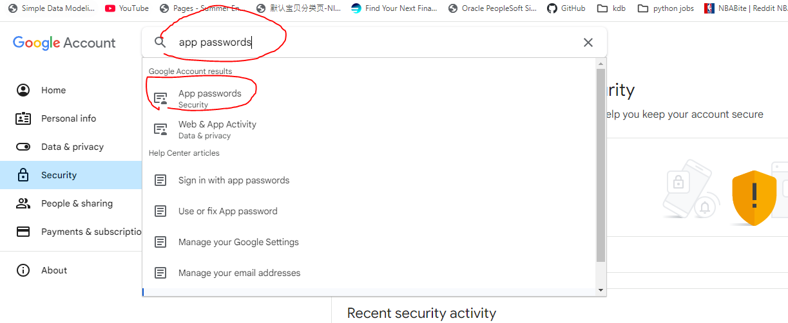
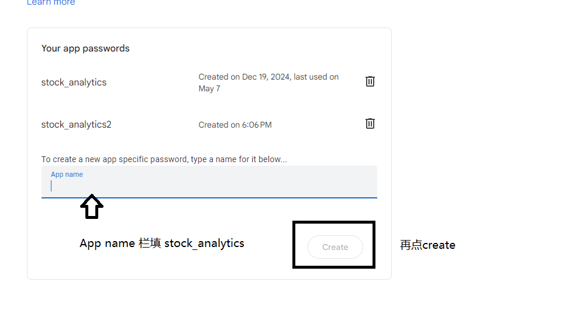
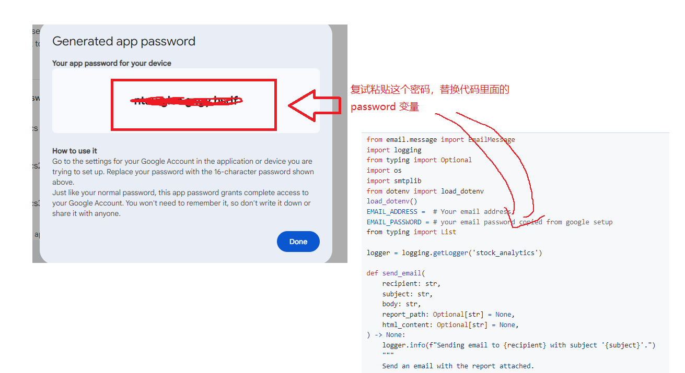

1. python 3.11(版本一定要对，超级重要！)
   下载链接：https://www.python.org/downloads/release/python-3110/
2. Visual studio code(代码开发 IDE)
   下载链接：https://code.visualstudio.com/download
3. Github account
   注册链接：https://github.com/
4. Gmail 邮箱(自动化发邮件用)
5. teams（上课用）
   下载链接：https://www.microsoft.com/en-ca/microsoft-teams/download-app
6. obs(用来录频，便于自己复习回顾上课的内容）
   下载链接：https://obsproject.com/download
7. sqlite studio
   下载链接：https://sqlitestudio.pl/

把邮箱发我建 repo, 添加 collaborator

### Lesson1: Self Learning

1. what is a virtual environment
   https://www.youtube.com/watch?v=Y21OR1OPC9A

2. Github 101
   https://www.youtube.com/watch?v=SD7YNLv5Evc

### Lesson 2

1. create virtual environment by running command(finish watching video above what is a virtual environment)

```
python -m venv venv
```

2. activate your virtual environment

on Windows, run command below in your project root directory terminal(see my screenshot below)

```
venv\Scripts\activate
```


macOS, run command below in your project root directory terminal

```
source venv/bin/activate
```

3. copy the requirements.txt in this repo to your project root directory

4. run command below(this install all the project dependencies listed in requirements.txt)

```
pip install -r requirements.txt
```

5. copy yahoo_finance_api_usage_example.py to your project root directory and run it and you should see the data output

#### Task 1. create a file called utilities.py and create function called fetch stock data in utilities.py

```python
def fetch_stock_data(
    ticker: str,
    period: Optional[str] = None,
    start_date: Optional[pd.Timestamp] = None,
    end_date: Optional[pd.Timestamp] = None,
) -> pd.DataFrame:
    """
    Fetch historical stock data for a specific ticker from Yahoo Finance.

    Parameters:
        ticker (str): Stock ticker symbol.
        period (Optional[str]): Period string for Yahoo Finance API (e.g., '1mo', '3mo', '1y').
        start_date (Optional[str]): Start date for fetching data.
        end_date (Optional[str]): End date for fetching data.

    Returns:
        pd.DataFrame: DataFrame with historical stock data.
    """

```

It should Output dataframe like below, for example fetch_stock_data("AAPL", period="1d")
should produce result in this screenshot


fetch_stock_data("AAPL", start_date=pd.Timestamp("2021-01-01"), end_date=pd.Timestamp("2021-01-31")) should looks like this below


### Lesson 3

1. install sqlite

What's ORM ?

ORM (Object-Relational Mapping) is a technique that allows developers to interact with a relational database using Python objects instead of writing raw SQL queries.

An ORM model is a Python class that represents a table in the database. Each class attribute corresponds to a column in the table, and each instance of the class represents a row in that table.

SQLAlchemy is a popular ORM library in Python that allows us to define and manipulate database tables using Python classes.

2. create database model

```
from sqlalchemy import Column, Integer, String, Float, Date, MetaData, Table, ForeignKey
from sqlalchemy.ext.declarative import declarative_base
Base = declarative_base()

class TickerPrice(Base):
    __tablename__ = "TickerPrice"
    Ticker = Column(String, primary_key=True)
    Date = Column(Date, primary_key=True)
    Close = Column(Float)
    Volume = Column(Integer)
    StockSplits = Column(Integer)
    Type = Column(String)


class TickerInfo(Base):
    __tablename__ = 'TickerInfo'
    Ticker = Column(String, primary_key=True)
    CompanyName = Column(String)
    Sector = Column(String)
    Industry = Column(String)
    Country = Column(String)
    MarketCap = Column(Float)
    PERatio = Column(Float)
    ForwardPERatio = Column(Float)
    Dividend = Column(Float)
    ROE = Column(Float)
    ROA = Column(Float)
    Description = Column(String)
    Website = Column(String)
    LastUpdated = Column(Date)


class SP500Holdings(Base):
    __tablename__ = TableList.SP500_HOLDINGS
    Ticker = Column(String, primary_key=True)
    Sector = Column(String)
    Industry = Column(String)
    CompanyName = Column(String)

```

alembic init alembic

alembic revision --autogenerate -m "Initial migration"

alembic upgrade head

3. create a folder called sqlitedb, inside this folder create a file called write.py and create a function called

```python
def write_data_to_sqlite(model: DeclarativeBase, data: pd.DataFrame) -> None:
    """
    Write data to a SQLite table using ORM model.

    Parameters:
        model: SQLAlchemy ORM model.
        data (pd.DataFrame): DataFrame containing the data to write.
    """
    session = Session()
    try:

        records = data.to_dict(orient='records')
        session.bulk_insert_mappings(model, records)
        session.commit()
        print(f"Data written to table {model.__tablename__} successfully.")
    except Exception as e:
        logger.error(f"Error writing data to SQLite table {model.__tablename__}: {e}")

    finally:
        session.close()


data = pd.DataFrame({
        'Ticker': ['AAPL', 'MSFT'],
        'Date': [pd.Timestamp(2024,1,1).date(), pd.Timestamp(2024,1,1).date()],
        'Close': [150.0, 250.0],
        'Volume': [10000, 200000],
        'StockSplits':[0,0],
        'Type':['Stock','Stock']
    })

write_data_to_sqlite(TickerPrice, data)

```

4. create a file called read.py and create a function called read_data_from_sqlite

```python
def read_data_from_sqlite(model, filters: Dict[str,any]= None,date_range: Tuple[str, str] = None) -> pd.DataFrame:

    """
    Read data from a SQLite table using ORM model with optional filters and date range.

    Parameters:
        model: SQLAlchemy ORM model.
        filters (Dict[str, any]): Dictionary of column-value pairs for filtering.
        date_range (Tuple[str, str]): Tuple containing the start and end dates for filtering.
        columns_to_select (Optional[List[str]]): List of columns to select.
        is_distinct (Optional[bool]): Whether to select distinct rows.

    Returns:
        pd.DataFrame: DataFrame containing the query results.
    """

    return df

def read_data_from_sqlite(model, filters: Dict[str, any] = None, date_range: Tuple[str, str] = None, columns_to_select: Optional[List[str]] = None, is_distinct: Optional[bool] = None) -> pd.DataFrame:
    """
    Read data from a SQLite table using ORM model with optional filters and date range.

    Parameters:
        model: SQLAlchemy ORM model.
        filters (Dict[str, any]): Dictionary of column-value pairs for filtering.
        date_range (Tuple[str, str]): Tuple containing the start and end dates for filtering.
        columns_to_select (Optional[List[str]]): List of columns to select.
        is_distinct (Optional[bool]): Whether to select distinct rows.

    Returns:
        pd.DataFrame: DataFrame containing the query results.
    """
    session = Session()
    try:
        query = session.query(model)

        if columns_to_select:
            query = query.with_entities(*[getattr(model, col) for col in columns_to_select])
        # else:
        #     query = query.with_entities(*[getattr(model, col) for col in model.__table__.columns.keys()])

        if is_distinct:
            query = query.distinct()

        if date_range:
            start_date, end_date = date_range
            query = query.filter(model.Date.between(start_date, end_date))

        if filters:
            for column, value in filters.items():
                query = query.filter(getattr(model, column) == value)

        results = query.all()

        if columns_to_select:
            df = pd.DataFrame(results, columns=columns_to_select)
        else:
            df = pd.DataFrame([item.__dict__ for item in results])
        # df = pd.DataFrame(results, columns=columns_to_select)
        if '_sa_instance_state' in df.columns:
            df.drop('_sa_instance_state', axis=1, inplace=True)

        print(f"Data read from SQLite successfully.")

    except Exception as e:
        print(f"Error reading data from SQLite: {e}")
        raise e
    finally:
        session.close()

    return df

```

### Lesson 4

5. create a function called ticker_data_processing in main.py

```python
def ticker_data_processing(
    mode: str,
    ticker: str,
    model,
    start_date: Optional[pd.Timestamp] = None,
    end_date: Optional[pd.Timestamp] = None,
    longest_period: Optional[str] = None,
) -> pd.DataFrame:
    """
    Fetch ticker data based on the mode and return all data for that ticker

    Parameters:
        mode (str): 'initial', 'daily', or 'rerun'
        start_date (Optional[pd.Timestamp]): Start date for rerun mode.
        end_date (Optional[pd.Timestamp]): End date for rerun mode.

    Returns:
        pd.DataFrame: DataFrame with ticker data.
    """
    # if mode is "initial":
        # fetch data using longest_period( 1y, 3y, etc)
        # write to sqlite db(calling the function you just created in step 1)

    # if mode is daily:
       # fetch data for just 1 day
       # write to db

    # if mode is rerun:
      # fetch stock data for start date and end date
      # upsert data to sqlite using the upsert_data_in_sqlite function below already created for you
      # put the upsert_data_in_sqlite function in write.py


def upsert_data_in_sqlite(model, set_values: dict, filters: dict=None, date_range: tuple = None) -> None:
    """
    Upsert data in a SQLite table using ORM model.

    Parameters:
        model: SQLAlchemy ORM model.
        set_values (dict): Dictionary of column-value pairs to set.
        filters (dict): Dictionary of column-value pairs for the WHERE clause.
        date_range (tuple): Tuple containing the start and end dates for filtering.
    """
    if not filters and not date_range:
        raise ValueError("A WHERE clause or date range must be provided to upsert data.")

    session = Session()
    try:
        query = session.query(model)
        if date_range:
            start_date, end_date = date_range
            query = query.filter(model.Date.between(start_date, end_date))

        if filters:
            for column, value in filters.items():
                query = query.filter(getattr(model, column) == value)

        existing_record = query.first()
        if existing_record:
            query.update(set_values)
            print(f"Data updated in table {model.__tablename__} successfully.")
        else:
            new_record = model(**set_values)
            session.add(new_record)
            print(f"Data inserted into table {model.__tablename__} successfully.")

        session.commit()
    except Exception as e:
        print(f"Error upserting data in SQLite table {model.__tablename__}: {e}")
    finally:
        session.close()
```

### Lesson 5

Create the calculate_returns function to calculate stock return

```python
def calculate_returns(
    df: pd.DataFrame, periods: list, period_days, ticker: str, report_date: pd.Timestamp
) -> dict:
    """
    Calculate returns for specified periods.

    Parameters:
        df (pd.DataFrame): DataFrame with an 'Adj Close' column.
        periods (list): List of periods for which to calculate returns.
        period_days (dict): Dictionary mapping periods to days.
        ticker (str): Stock ticker symbol.

    Returns:
        dict: Dictionary of returns for each period.
    """
    returns = {"Ticker": ticker}

    for period in periods:
        try:
            if period in ['1d', '3d', '5d']:
                # Use trading days for 1d, 3d, 5d periods
                start_date = report_date
                trading_days = 0 # <=
                period_days = {'1d':1, '3d':3, '5d':5, '1y':365}
                while trading_days < period_days[period]:
                    start_date -= timedelta(days=1)
                    if start_date.weekday() < 5:  # Monday to Friday are trading days
                        trading_days += 1
                start_date = start_date.date()
            else:
                start_date = (report_date - timedelta(days=period_days[period])).date()
        except Exception as e:
            logger.error(
                f"Error calculating start_date for {ticker} during {period}: {e}"
            )
            print(f"Error calculating start_date for {ticker} during {period}: {e}")
            returns[f"{period}_return"] = 0
            continue  # Skip to the next period

        # Convert start_date to pandas Timestamp and normalize
        # start_date_normalized = pd.Timestamp(start_date).normalize().tz_localize('UTC')
        # Normalize dates to ignore timezone and other attributes
        report_date_data = df[df["Date"] == report_date.date()]["Close"]
        if report_date_data.empty:
            logger.error(f"No data found for {ticker} on {report_date.date()}")
            print(f"No data found for {ticker} on {report_date.date()}")
            raise Exception(f"No data found for {ticker} on {report_date.date()}")
        else:

            report_date_price = report_date_data.values[0]
        if start_date in df["Date"].values:
            try:

                lookback_date_price = df[df["Date"] == start_date]["Close"].values[0]
                returns[f"{period}_return"] = round(
                    (report_date_price / lookback_date_price - 1), 4
                )
            except Exception as e:
                logger.error(
                    f"Error calculating return for {ticker} during {period}: {e}"
                )
                print(f"Error calculating return for {ticker} during {period}: {e}")
                returns[f"{period}_return"] = 0
        else:
            # If start date is not in the data, calculate the return using the closest available date
            neighbour_days = get_neighbour_days(start_date)
            for adj_lookback_date in neighbour_days:
                if adj_lookback_date in df["Date"].values:
                    try:
                        lookback_date_price = df[df["Date"] == adj_lookback_date][
                            "Close"
                        ].values[0]
                        returns[f"{period}_return"] = round(
                            (report_date_price / lookback_date_price - 1), 4
                        )
                        break
                    except Exception as e:
                        logger.error(
                            f"Error calculating return for {ticker} on {adj_lookback_date} during {period}: {e}"
                        )
                        returns[f"{period}_return"] = pd.NA
                        continue
            else:
                returns[f"{period}_return"] = 0
    return returns
```

### Lesson 6

Finish top_gainers functions below

```Python

def get_top_gainers(
    tickers: list,
    lookback_periods: list,
    mode: str,
    all_tickers: List[str],
    start_date: Optional[pd.Timestamp] = None,
    end_date: Optional[pd.Timestamp] = None,
    benchmark_against_sp500: bool = True,
) -> pd.DataFrame:
    logger.info(f"Running get_top_gainers in '{mode}' mode.")
    """
    Screen top gainers for a list of tickers over specified lookback periods,
    including S&P 500 returns for each period.

    Parameters:
        tickers (list): List of stock tickers.
        lookback_periods (list): List of periods for which to calculate returns.
        mode (str): 'initial', 'daily', or 'rerun'
        start_date (Optional[str]): Start date for rerun mode.
        end_date (Optional[str]): End date for rerun mode.

    Returns:
        pd.DataFrame: DataFrame with returns for each ticker and time period,
                      including S&P 500 returns.
    """
    results = []

    # Convert periods to days for comparison
    period_days = {
        "1d": 1,
        "3d": 3,
        "5d": 5,
        "14d": 14,
        "21d": 21,
        "1mo": 30,
        "2mo": 60,
        "3mo": 90,
        "4mo": 120,
        "5mo": 150,
        "6mo": 180,
        "1y": 365,
    }
    lookback_periods = [
        "1d",
        "3d",
        "5d",
        "14d",
        "21d",
        "1mo",
        "2mo",
        "3mo",
        "4mo",
        "5mo",
        "6mo",
        "1y",
    ]

    longest_period = max(lookback_periods, key=lambda x: period_days[x])

    # Fetch S&P 500 returns
    if benchmark_against_sp500:
        sp500_df = ticker_data_processing(
            mode, "^GSPC", IndexPrice, start_date, end_date, longest_period
        )
        sp500_returns = calculate_returns(
            sp500_df, lookback_periods, period_days, "S&P500", start_date
        )

    count = 0
    for ticker in tickers:
        count += 1
        try:
            if ticker not in all_tickers:
                ticker_df = ticker_data_processing(
                    "initial", ticker, StocksPrice, start_date, end_date, longest_period
                )
            else:
                ticker_df = ticker_data_processing(
                    mode, ticker, StocksPrice, start_date, end_date, longest_period
                )

            returns = calculate_returns(
                ticker_df, lookback_periods, period_days, ticker, start_date
            )
            if benchmark_against_sp500:
                for period in lookback_periods:
                    returns[f"{period}_SP500_return"] = sp500_returns.get(
                        f"{period}_return", 0
                    )
            results.append(returns)
        except Exception as e:
            logger.error(f"Error fetching data for {ticker}: {e}")
            print(f"Error fetching data for {ticker}: {e}")
            continue
        print(f"Processed {count} tickers.")
    # Convert results to a DataFrame
    result_df = pd.DataFrame(results)
    result_df = result_df.sort_values(
        by=f"{lookback_periods[0]}_return", ascending=False
    )
    logger.info("Completed getting top gainers.")
    return result_df


def enrich_with_sector_industry(df: pd.DataFrame) -> pd.DataFrame:
    """
    Enrich the DataFrame with sector and industry information.

    Parameters:
        df (pd.DataFrame): DataFrame with stock data.
        info_path (str): Path to the CSV file containing sector and industry information.

    Returns:
        pd.DataFrame: Enriched DataFrame with sector and industry columns.
    """
    sp500_sector_df = read_data_from_sqlite(SP500Holdings)
    sp500_sector_df = sp500_sector_df.drop_duplicates(subset=["Ticker"])
    enriched_df = df.merge(sp500_sector_df, on="Ticker", how="left")
    return enriched_df


```

### Lesson 7

Finish filter_data_by_thresholds

```Python
def filter_data_by_thresholds(
    increase_thresholds,
    decrease_thresholds,
    period: str,
    df: pd.DataFrame,
    final_output_columns: list[str],
) -> pd.DataFrame:
    """
    Filter dataframe based on provided thresholds and period returns.
    This function filters a DataFrame based on threshold values for a given period's returns,
    creating categories/buckets of data that fall within specified threshold ranges.
    Args:
        thresholds (list[float]): List of threshold values to filter the data
        period (str): Time period to analyze returns (e.g., 'daily', 'weekly', 'monthly')
        df (pd.DataFrame): Input DataFrame containing return data
        final_output_columns (list[str]): List of columns to include in the output DataFrame
        threshold_type (str): Type of threshold being applied (e.g., 'Return', 'Gain', 'Loss')
    Returns:
        pd.DataFrame: Filtered DataFrame containing only rows that meet the threshold criteria,
                     with an additional 'Threshold' column indicating the range.
    Example:
        >>> thresholds = [0.05, 0.10, 0.15]
        >>> filter_data_by_thresholds(thresholds, 'daily', df, ['Date', 'Close'], 'Return')
        Returns DataFrame with rows where daily returns fall within specified threshold ranges
    """
    period_data = []
    for i, threshold in enumerate(increase_thresholds):
        if i < len(increase_thresholds) - 1:
                    next_threshold = increase_thresholds[i + 1]
                    increase_df = df[
                        (df[f"{period}_return"] > threshold)
                        & (df[f"{period}_return"] <= next_threshold)
                    ]
        else:
            increase_df = df[df[f"{period}_return"] > threshold]

        if not increase_df.empty:
            increase_df = increase_df[final_output_columns]
            increase_df["Threshold"] = (
                f"{threshold * 100}% < Increase <= {next_threshold * 100}%"
                if i < len(increase_thresholds) - 1
                else f"Increase > {threshold * 100}%"
            )
            period_data.append(increase_df)

    for i, threshold in enumerate(decrease_thresholds):
        if i < len(decrease_thresholds) - 1:
            next_threshold = decrease_thresholds[i + 1]
            decrease_df = df[
                (df[f"{period}_return"] < -threshold)
                & (df[f"{period}_return"] >= -next_threshold)
            ]
        else:
            decrease_df = df[df[f"{period}_return"] < -threshold]

        if not decrease_df.empty:
            decrease_df = decrease_df[final_output_columns]
            decrease_df["Threshold"] = (
                f"{-next_threshold * 100}% <= Decrease < {-threshold * 100}%"
                if i < len(decrease_thresholds) - 1
                else f"Decrease < {-threshold * 100}%"
            )
            period_data.append(decrease_df)
    return period_data

```

```Python
def prepare_report_data(
    df: pd.DataFrame ,
    lookback_periods: List[str],
    increase_thresholds: List[float],
    decrease_thresholds: List[float],

    columns: List[str],
    ) -> List[dict]:
    """Prepares report data by filtering and processing a DataFrame based on specified
    lookback periods, thresholds, and columns.

    Args:
        df (pd.DataFrame): The input DataFrame containing stock data.
        lookback_periods (List[str]): A list of lookback periods (e.g., '1d', '1w', '1m')
            to calculate returns and filter data.
        increase_thresholds (List[float]): A list of thresholds for filtering rows where
            returns exceed these values.
        decrease_thresholds (List[float]): A list of thresholds for filtering rows where
            returns fall below these values.
        columns (List[str]): A list of column names to include in the final output.

    Returns:
        List[dict]: A dictionary where each key is a lookback period, and the value is a
    list of dictionaries representing the filtered and sorted data for that period.
    """
    final_output_data = {}
    for period in lookback_periods:
        final_output_columns = columns + [
            f"{period}_return",
            f"{period}_SP500_return",
        ]
        period_data = filter_data_by_thresholds(
            increase_thresholds, decrease_thresholds,period, df, final_output_columns,
        )

        if period_data:
            combined_df = pd.concat(period_data)
            combined_df = combined_df.sort_values(
                by=f"{period}_return", ascending=False
            )

            final_output_data[period] = combined_df.to_dict(orient="records")
    return final_output_data

```

```Lesson 8
put HTML_TEMPLATE and generate_market_scanner_html_report below in generate_report.py
HTML_TEMPLATE = """
<!DOCTYPE html>
<html lang="en">
<head>
    <meta charset="UTF-8">
    <meta name="viewport" content="width=device-width, initial-scale=1.0">
    <style>
        body { font-family: Arial, sans-serif; margin: 20px; }
        h1 { font-size: 28px; margin-bottom: 20px; }
        h2 { font-size: 20px; color: #333; margin-top: 30px; }
        table {
            width: auto;
            border-collapse: collapse;
            margin-top: 10px;
            table-layout: fixed;
        }
        th, td {
            border: 1px solid #ddd;
            padding: 4px 8px;
            text-align: center;
        }
        th { background-color: #f4f4f4; font-weight: bold; }
        .ticker { color: #1e90ff; font-weight: bold; } /* Ticker styling */
        .positive { color: green; }
        .negative { color: red; }
        .separator { border-top: 2px dashed yellow; margin: 20px 0; }
        .header {
            text-align: center;
        }
        .name-column {
            max-width: 200px;
            min-width: 150px;
            white-space: nowrap;
            overflow: hidden;
            text-overflow: ellipsis;
        }
        .return-column {
            width: 60px;
            white-space: nowrap;
            padding: 4px;
        }
        .ticker-column {
            width: 50px;
            white-space: nowrap;
            color: #1e90ff;
            font-weight: bold;
        }
    </style>
    <title>SP500 Market Scanner Report </title>
</head>
<body>
    <h1 class="header">{{ report_date }}</h1>
    <h1 class="header">{{report_name}} Report</h1>
    
        <h2>{{ period}} Returns</h2>
        <table>
            <thead>
                <tr>
                    <th class="ticker-column">Ticker</th>
                    <th class="name-column">Company Name</th>
                    <th class="name-column">Sector</th>
                    <th class="name-column">Industry</th>
                    <th class="return-column">{{period}}_return</th>
                    <th class="return-column">{{period}}_SP500_return</th>
                    <th class="return-column">Threshold</th>
                </tr>
            </thead>
            <tbody>
                
                <tr>
                    <td class="ticker-column">{{ item['Ticker'] }}</td>
                    <td class="name-column">{{ item['CompanyName'] }}</td>
                    <td class="name-column">{{ item['Sector'] }}</td>
                    <td class="name-column">{{ item['Industry'] }}</td>
                    <td class="return-column {{ 'positive' if item[period + '_return'] > 0 else 'negative' }}">
                        {{ '%.2f%%' % (item[period + '_return'] * 100) }}
                    </td>
                      <td class="return-column {{ 'positive' if item[period +'_SP500_return'] > 0 else 'negative' }}">
                        {{ '%.2f%%' % (item[period + '_SP500_return'] * 100) }}
                    </td>
                    <td class="name-column">{{ item['Threshold'] }}</td>
                </tr>
                
            </tbody>
        </table>
    
</body>
</html>
"""

def generate_market_scanner_html_report(data, report_date,report_name):
    template = Template(HTML_TEMPLATE)
    html_content = template.render(data=data, report_date=report_date, report_name=report_name)
    output_file = f"./reports/{report_name}.html"
    with open(output_file, "w", encoding="utf-8") as f:
        f.write(html_content)
    return html_content

Put generate_html_report in main.py

def generate_html_report(df: pd.DataFrame,
    lookback_periods: list,
    increase_thresholds: list,
    decrease_thresholds: list,
    report_date_str: str,
    columns: List[str],
    report_name: str) ->None:


    report_data = prepare_report_data(
        df,
        lookback_periods,
        increase_thresholds,
        decrease_thresholds,
        columns,
    )
    df.to_csv(f"data/{report_name}.csv")
    html_content = generate_market_scanner_html_report(report_data,report_date_str,report_name)
    logger.info(f"Report generated successfully: {report_name}")
    return html_content


Put generate_market_scanner_report in main.py

def generate_market_scanner_report(
    sp500_tickers,
    lookback_periods: list,
    increase_thresholds: list,
    decrease_thresholds: list,
    mode,
    current_date,
    report_name: str,
    all_tickers: List[str],
) -> None:
    top_gainers = get_top_gainers(
        sp500_tickers,
        lookback_periods,
        mode=mode,
        all_tickers=all_tickers,
        start_date=current_date,
        end_date=current_date + timedelta(days=1),
    )

    if top_gainers.empty:
        raise Exception(f"No data available to generate the report for {current_date}")

    current_date_str = current_date.strftime("%Y-%m-%d")

    # Enrich top_gainers with sector and industry information
    top_gainers = enrich_with_sector_industry(top_gainers)
    column_output = [
            "Ticker",
            "CompanyName",
            "Sector",
            "Industry",
        ]

    html_content = generate_html_report(top_gainers,
        lookback_periods,
        increase_thresholds,
        decrease_thresholds,
        current_date_str,
        column_output,
        report_name
    )
    send_email(
    recipient=args.recipient,
    subject=f"{report_name} Report {current_date_str}",
    body="",
    html_content=html_content,
)

    logger.info(
        f"Market scanner Report for {current_date_str} generated and emailed successfully."
    )


```

### Lesson 8

1. put function below in utilities.py(create it if doesn't exist)

```python
from email.message import EmailMessage
import logging
from typing import Optional
import os
import smtplib
from dotenv import load_dotenv
load_dotenv()
EMAIL_ADDRESS =  # Your email address
EMAIL_PASSWORD = # your email password copied from google setup
from typing import List

logger = logging.getLogger('stock_analytics')

def send_email(
    recipient: str,
    subject: str,
    body: str,
    report_path: Optional[str] = None,
    html_content: Optional[str] = None,
) -> None:
    logger.info(f"Sending email to {recipient} with subject '{subject}'.")
    """
    Send an email with the report attached.

    Parameters:
        report_path (str): Path to the report file.
        recipient (str): Recipient's email address.
        subject (str): Subject of the email.
        body (str): Body of the email.
    """
    msg = EmailMessage()
    msg["Subject"] = subject
    msg["From"] = EMAIL_ADDRESS # replace with your email address
    msg["To"] = recipient
    msg.set_content(body)
    if html_content:
        msg.add_alternative(html_content, subtype="html")
    if report_path:
        # Attach the report
        with open(report_path, "rb") as f:
            file_data = f.read()
            file_name = os.path.basename(report_path)
        msg.add_attachment(
            file_data,
            maintype="application",
            subtype="octet-stream",
            filename=file_name,
        )

    # Send the email
    try:
        with smtplib.SMTP_SSL("smtp.gmail.com", 465) as smtp:
            smtp.login(EMAIL_ADDRESS, EMAIL_PASSWORD) # replace with your email address and password
            smtp.send_message(msg)
        logger.info("Email sent successfully.")
    except Exception as e:
        print(f"Error sending email: {EMAIL_ADDRESS} {EMAIL_PASSWORD}")
        logger.error(f"Error sending email: {e}")
```

Set up gmail in python

✅ Step-by-step Setup

1. Enable "App Passwords" in Gmail
   If your Google account has 2FA enabled (which it should):

Go to https://myaccount.google.com/security

2. Search "app passwords"(see screenshot below)
   

3. Create a name for your app(see screenshot below)



4. You’ll get a 16-character password (copy it — use it in place of your real password)(see screenshot below)



### Lesson 9

put functions below in utils.py

```python
def get_all_tickers(model)->List[str]:

    all_tickers = read_data_from_sqlite(model, columns_to_select=['Ticker'], is_distinct=True)
    return set(all_tickers["Ticker"].unique())

from datetime import  timedelta
def get_neighbour_days(start_date) -> list[datetime]:
    logger.debug(f"Getting neighbour days for start_date {start_date}.")
    """
    Get the previous and next day of the start date
    """
    res = []
    for i in range(1, 4):
        adjust_start_date_backwards = start_date - timedelta(days=i)
        adjust_start_date_forwards = start_date + timedelta(days=i)
        res.append(adjust_start_date_backwards)
        res.append(adjust_start_date_forwards)
    return res
```

add code below to main.py

```Python
import traceback
def main(start_date, end_date, mode, sp500_tickers=["AAPL", "MSFT"]):
    increase_thresholds = [0.05, 0.1, 0.2, 0.3, 0.4, 0.5, 1, 2]
    decrease_thresholds = [0.05, 0.1, 0.2, 0.3, 0.4, 0.5, 1, 2]
    lookback_periods = [
        "1d",
        "3d",
        "5d",
        "14d",
        "21d",
        "1mo",
        "2mo",
        "3mo",
        "4mo",
        "5mo",
        "6mo",
        "1y",
    ]
    if not sp500_tickers:
        sp500_tickers = get_all_tickers(SP500Holdings)

    date_range = pd.date_range(start=start_date, end=end_date)
    all_tickers = get_all_tickers(StocksPrice)
    for current_date in date_range:
        generate_market_scanner_report(
            sp500_tickers,
            lookback_periods,
            increase_thresholds,
            decrease_thresholds,
            mode,
            current_date,
            report_name="SP500 Market Scanner",
            all_tickers=all_tickers,
        )


# TODO 1. add sector to the report
# TODO 2. add company name to the report

if __name__ == "__main__":


    try:
        main("2023-10-01", "2023-10-31", "rerun")
    except Exception as e:
        traceback_str = traceback.format_exc()
        raise

```
