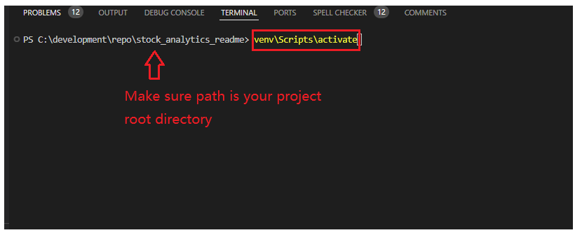
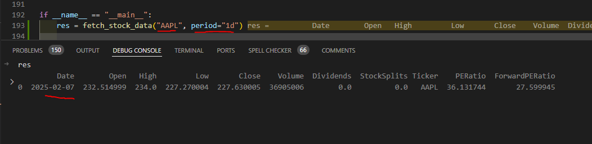
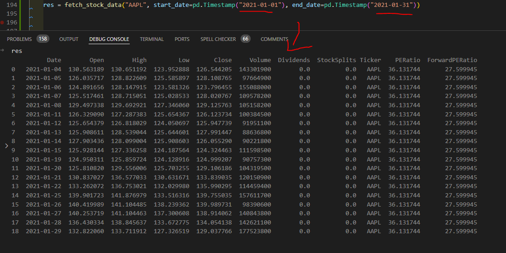

### Lesson1: Self Learning
1. what is a virtual environment
https://www.youtube.com/watch?v=Y21OR1OPC9A

2. Github 101
https://www.youtube.com/watch?v=SD7YNLv5Evc


### Lesson 2. self Learning(prep for class)
1. create virtual environment by running command(finish watching video above what is a virtual environment)
```
python -m venv venv
```
2. activate your virtual environment

on Windows, run command below in your project root directory terminal(see my screenshot below)

```
venv\Scripts\activate
```



macOS,  run command below in your project root directory terminal


```
source venv/bin/activate
```

3. copy the requirements.txt in this repo to your project root directory

4. run command below(this install all the project dependencies listed in requirements.txt)
```
pip install -r requirements.txt
```

5. copy yahoo_finance_api_usage_example.py to your project root directory and run it and you should see the data output


### Lesson 2 
#### Task 1. create a file called utilities.py and create function called fetch stock data in utilities.py
```python
def fetch_stock_data(
    ticker: str,
    period: Optional[str] = None,
    start_date: Optional[pd.Timestamp] = None,
    end_date: Optional[pd.Timestamp] = None,
) -> pd.DataFrame:
    """
    Fetch historical stock data for a specific ticker from Yahoo Finance.

    Parameters:
        ticker (str): Stock ticker symbol.
        period (Optional[str]): Period string for Yahoo Finance API (e.g., '1mo', '3mo', '1y').
        start_date (Optional[str]): Start date for fetching data.
        end_date (Optional[str]): End date for fetching data.

    Returns:
        pd.DataFrame: DataFrame with historical stock data.
    """

```
It should Output dataframe like below, for example fetch_stock_data("AAPL", period="1d")
should produce result in this screenshot


fetch_stock_data("AAPL", start_date=pd.Timestamp("2021-01-01"), end_date=pd.Timestamp("2021-01-31")) should looks like this below



#### Task 2. 
1. create a folder called sqlitedb, inside this folder create a file called write.py and create a function called 
```python
def write_data_to_sqlite(model, data: pd.DataFrame,clear_existing_data=False) -> None:
    pass
```
2. create a file called read.py and create a function called read_data_from_sqlite
```python
def read_data_from_sqlite(model) -> pd.DataFrame:

    """
    Read data from a SQLite table using ORM model with optional filters and date range.
    
    Returns:
        pd.DataFrame: DataFrame containing the query results.
    """

```
3. create a function called ticker_data_processing in main.py
```python
def ticker_data_processing(
    mode: str,
    ticker: str,
    model,
    start_date: Optional[pd.Timestamp] = None,
    end_date: Optional[pd.Timestamp] = None,
    longest_period: Optional[str] = None,
) -> pd.DataFrame:
    """
    Fetch ticker data based on the mode and date range.

    Parameters:
        mode (str): 'initial', 'daily', or 'rerun'
        start_date (Optional[pd.Timestamp]): Start date for rerun mode.
        end_date (Optional[pd.Timestamp]): End date for rerun mode.

    Returns:
        pd.DataFrame: DataFrame with ticker data.
    """
    # if mode is "initial":
        # fetch data using longest_period( 1y, 3y, etc)
        # write to sqlite db(calling the function you just created in step 1)
    
    # if mode is daily:
       # fetch data for just 1 day
       # write to db
```


### Lesson 3 set up database
4. create a models.py inside sqlite folder


